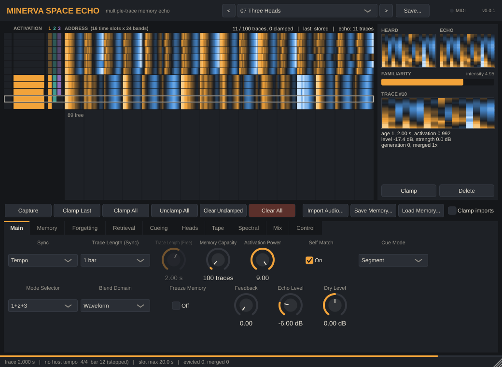

# MINERVA Space Echo

An experimental audio effect (AU / VST3 for macOS, aimed at Ableton Live) that
treats Hintzman's **MINERVA II** multiple-trace memory model as a tape echo. A
Roland Space Echo has one tape loop. This plugin stores every segment of incoming
audio as a separate memory trace, and plays back an *echo*: a blend of all the
traces, each weighted by how similar it is to what you are playing now.

See [`plan.md`](plan.md) for the concept and the staged build plan.

**Status: Stage 7 (custom UI and control).** The plugin cuts the input into traces
(1 bar by default, tempo-synced or free). It stores up to 100 of them and
cues memory with each bar you play. It then plays the resulting echo, an
activation-weighted blend of stored bars, during the next bar. With Memory
Capacity = 1 it is exactly a 1-bar tape delay. Stage 2 adds control over what
memory keeps: freezing, write gates, clamping, full-memory policies,
consolidation, forgetting, echo re-encoding, and saving and loading memory.
Stage 3 lets the live input cue memory *while it plays*: progressively within
the bar, or with no bar grid at all (rolling). Stage 4 adds RE-201-style
playback heads, chorus voices, random sampling, and other cue sources
(sidechain, random, frozen). Stage 5 adds the machine itself: varispeed,
wow and flutter, tape drive, hiss, bass/treble in the feedback path, and a
spring reverb. Stage 6 can blend memories as spectra instead of waveforms,
time-stretch old traces to a new repeat rate without changing pitch, freeze
the echo's spectrum into a drone, and hold thousands of tiny "grain" traces.
Stage 7 gives it its own window, built around a live view of the memory
matrix, plus presets, drag-and-drop audio import and MIDI control.



## How it behaves

At every trace boundary (e.g. each bar line):

1. The bar just played is **stored** as a trace: its audio, plus a feature
   vector (16 time slots × 24 frequency bands, level-independent) that serves
   as its address.
2. The same bar is the **cue** (probe). Each stored trace's similarity *S* to
   the cue becomes an activation *A = sign(S)·|S|^power*.
3. The **echo** heard during the next bar is Σ *A·trace audio*, normalised.

That is **Cue Mode = Segment**. Two live modes change *when* memory is cued:

- **Progressive:** from the *Progressive Start* slot (of 16 per bar) on, memory
  is re-cued at every slot with the part of the bar heard so far, compared
  with the same stretch of each stored bar. Bars that began like this one
  play along in step with you, and the echo sharpens as the bar unfolds.
  Before that slot, the previous bar's Segment echo plays.
- **Rolling:** no bar grid. Every *Rolling Interval*, the last *Rolling Window*
  of input is searched for at every position inside every stored trace
  (20 ms frames, then refined to about 1 ms). Memory then plays what
  *followed* the best matches, aligned with now. The search is spread over
  audio blocks with a fixed work budget, so it never spikes the CPU. Traces
  must be longer than the window (the status line warns if not).

## Parameters

| Parameter | What it does |
|---|---|
| **Sync** / **Trace Length (Sync)** / **Trace Length (Free)** | Trace length: 1/16 … 4 bars following Live's tempo, or 10 ms … 20 s free-running. Tempo-synced traces align to Live's bar grid. |
| **Memory Capacity** / **Memory Budget** | Max traces (1–4000) and the audio memory reserved for them (128 MB – 4 GB; with many traces the budget limits the longest trace). Changing either keeps the traces (clamped first, then newest). |
| **When Full** | Which trace makes room: Oldest, Random, Least Used (lowest recent activation), Weakest (most faded), Merge Similar (average the new bar into its closest unclamped trace), or Reject (keep what's there). |
| **Consolidate Above** | Merge a new bar into an existing trace whenever they are at least this similar, even if there is room (1 = off). Prototypes form. |
| **Freeze Memory** | Stop storing and stop decay; memory keeps answering. |
| **Write Mode** / **Capture** | Auto stores every bar that passes the gates; Manual stores only captured bars. Capture (parameter or button) stores the bar in progress, bypassing gates and freeze. |
| **Write Gate** | Bars quieter than this aren't stored (−100 dB = off). |
| **Novelty Gate** / **Novelty Threshold** | Store only novel bars (nothing in memory this similar) or only familiar ones. |
| **Write Probability** | Chance that a bar is stored. |
| **Record Source** | What gets stored: the Input (plus feedback), the Echo (memory feeds on itself; it keeps sustaining after the input stops), or both. |
| **Clamp Incoming** / **Clamp Budget** / **Clamped Don't Decay** | Clamp newly stored bars; the most memory that may be clamped; whether clamped traces are exempt from forgetting. Clamped traces are never replaced. |
| **Tape Dropouts** | At recording, each 1/32 of a trace may drop out. |
| **Forgetting / Segment** / **Fading / Segment** | Each bar, stored traces lose features (weaker recall) and strength (weaker activation). Traces faded below −60 dB are forgotten. |
| **Wear Tone** | Older traces play back duller. |
| **Cue Mode** | Segment (echo of the last bar, like a delay), Progressive (memory follows the bar as it unfolds), or Rolling (unclocked search). |
| **Progressive Start** | Slot (of 16) from which the progressive cue takes over. |
| **Rolling Window** / **Rolling Interval** | Length of the live cue, and how often memory is searched. |
| **Prediction** | Play memory this far ahead of the current position: hear what came next last time. |
| **Cue Smoothing** | Crossfade whenever a live cue changes the echo. |
| **Cue Source** | What cues memory: the Input, the **Sidechain** (route another track to the plugin's sidechain input in Live), a Random address (memory dreams), or Frozen (the last live cue, held). |
| **Feature Focus** | Match on everything, on Rhythm only (loudness over time), or on Timbre only (average spectrum). Applies to Segment and Progressive cueing. |
| **Recency** | Favour recently stored traces (0 = no preference). |
| **Mode Selector** | The RE-201's head combinations: 1, 2, 3, 2+3, 1+2, 1+3, 1+2+3 (delay heads), Iterative 1+2+3, or Custom (use the per-head settings). |
| **Head 1–3 Level / Pan**, **Head 2 / Head 3** | Head 1 is the main echo. A **Delay** head replays what head 1 played 1 (head 2) or 2 (head 3) segments earlier, like tape heads further along. An **Iterative** head is cued by the previous head's echo (the echo of the echo), drifting toward memory's prototype. Heads 2–3 update at bar lines (not in Rolling mode). |
| **Playback** / **Voices** / **Voice Spread** / **Voice Detune** / **Voice Delay** | Blend all active memories (MINERVA's echo), play the strongest few as separate chorus **Voices** (the strongest in the centre, the rest fanned out, detuned and delayed), or **Sample** one memory at random, weighted by activation. |
| **Echo Tone** / **Familiarity > Tone** / **Familiarity > Feedback** | A low-pass on the echo, and routings of familiarity (the strongest activation) to its cutoff and to the feedback amount. |
| **Activation Power** | 1 = every memory contributes (a blurred "schema"); 9 = only the closest memories answer. |
| **Similarity** | Hintzman (MINERVA II's normalised dot product) or Cosine. |
| **Features** / **Ternary Threshold** | Continuous feature values, or classic MINERVA −1/0/+1 values. |
| **Encoding Failure (Lf)** | Probability that each feature of a *stored* trace is lost (tape wear for the address). |
| **Self Match** | On: the bar just played can answer its own cue (the delay-like part). Off: memory answers only with *earlier* bars. |
| **Cue Gate** | Segments quieter than this don't cue memory (stops the noise floor from triggering echoes). |
| **Negative Activations** | Subtract (phase-inverted, true MINERVA), Ignore, or Absolute. |
| **Echo Normalization** | Sum (constant loudness), Max, or Familiarity (echo is quiet when the cue resembles nothing in memory). |
| **Echo Level Tracking** | 1: echo level follows the cue's level, like a tape repeat, so feedback decays. 0: memories return at their own level. |
| **Length Mismatch** | When a stored trace was recorded at a different trace length (you changed the repeat rate or the tempo): **Varispeed** plays it faster or slower to fit, so its pitch shifts like tape; **Cut** plays it as recorded; **Loop** repeats a shorter trace to fill the segment; **Stretch** time-stretches it to fit (phase vocoder), keeping its pitch. |
| **Blend Domain** | **Waveform**: the echo is the activation-weighted sum of trace audio (exact, but unaligned memories can cancel or comb-filter). **Spectral**: each memory's short-time magnitude spectrum is weighted and summed, and every frequency bin takes the phase of the memory loudest there, so memories blend without cancelling. Spectral frames are ~43 ms, so echo changes fade in over about that long; Detune, Wow/Flutter and Loop are ignored in this mode. |
| **Spectral Voices** | How many of the most active memories (per head) are analysed each spectral frame (1–32). Fewer = cheaper and clearer. |
| **Spectral Freeze** | Holds the current echo spectrum as a drone (its partials keep turning at their measured frequencies). Memory can change or be cleared underneath it. |
| **Max Active Traces** | Blends use at most this many of the most active traces (1–512; the rest are dropped and the level kept). Keeps very large memories — e.g. thousands of 15 ms "grain" traces — cheap. |
| **Wow** / **Flutter** | Slow (drifting, ~0.5 Hz, up to 6 ms) and fast (~7 Hz, up to 0.5 ms) speed wobble of the echo. |
| **Tape Drive** | Soft saturation of the echo (unity for quiet signals), which also shapes what feeds back. |
| **Hiss** | Tape noise on the echo (−100 dB = off). With feedback it gets recorded along with the repeats. |
| **Feedback Bass** / **Feedback Treble** | ±12 dB shelves (250 Hz / 3 kHz) inside the feedback path, like the RE-201's controls: each repeat gets darker or thinner. |
| **Spring Level** / **Spring Decay** / **Spring On Dry** | A spring-reverb tail on the echo (and optionally on the dry signal, as in the RE-201's reverb modes). −60 dB = off. |
| **Feedback** | Echo mixed back into what gets recorded (soft-clipped; >1 allowed). |
| **Echo Level** / **Dry Level** / **Output Gain** | Mix. −60 dB = off. |
| **Edge Fade** | Fade length at trace edges and when the echo changes (declicking). |

| **MIDI Note Control** / **MIDI Channel** / **MIDI Base Note** | Whether MIDI notes trigger actions, on which channel (Any = all), and the first note of the map (see *MIDI control*). |
| **Clamp Last / Clamp All / Unclamp All / Clear Unclamped / Clear All (Trigger)** | The memory buttons as parameters: each fires when switched on. Map them to pads with Live's MIDI Map mode, or automate them. |

## The plugin window

- **Memory matrix** (top left). One row per stored trace, oldest at the top.
  The coloured strip is the trace's *address*, exactly as MINERVA stores it:
  16 time slots, each a 24-band spectrum (amber above the trace's average
  level, blue below). Left of it: a **lock** column (click to clamp or
  unclamp a trace), the trace's **activation** in the last retrieval (amber
  positive, blue negative), and which **heads** are playing it right now
  (1 amber, 2 teal, 3 violet). Rows grow tall while memory is nearly empty
  and shrink as it fills; with thousands of traces each pixel row shows the
  strongest of its traces. Hover a row for its details; click it to inspect.
- **Heard / Echo** (top right). The address of the last segment you played
  (the cue) and the echo's content (the activation-weighted blend of the
  answering traces' addresses, MINERVA's echo). Time runs left to right, low
  bands at the bottom.
- **Familiarity**. The strongest activation (how well memory recognised the
  cue) and MINERVA's intensity (the sum of activations).
- **Selected trace**. Its address, age, length, level, strength, generation
  (heard or echo) and merges, with **Clamp** and **Delete** buttons.
- **Buttons**: **Capture**, **Clamp Last**, **Clamp All**, **Unclamp All**,
  **Clear Unclamped**, **Clear All**, **Import Audio…**, **Save Memory…**,
  **Load Memory…**, and **Clamp imports**.
- **Parameter pages**: Main (the essentials), Memory, Forgetting, Retrieval,
  Cueing, Heads, Tape, Spectral, Mix and Control. Settings that have no effect
  with the current choices (say, Trace Length (Free) while synced to tempo) are
  dimmed. Double-click a knob to reset it.
- **Status bar**: progress through the current trace, trace length, host
  tempo and bar, the longest trace a memory slot can hold, and evictions and
  merges. Messages (imports, saves, presets) appear here too.

**Presets.** The menu at the top holds three sets: *Factory* (21 presets
meant for playing, with the dry signal on), *Examples* (the listening
examples, mostly echo only) and *User*. **Save…** writes the current
settings to `~/Music/MINERVA Space Echo/Presets/<name>.txt`. Presets use the
same `key = value` text format as `mse-render`, and list only settings that
differ from the defaults. Loading a preset resets everything else to its
default, except session settings (memory budget, Save Memory With Set, MIDI).
Timed lines (`@8 freeze = on`) only apply in offline renders. Live's own
device presets (.adv) also work as usual.

**Importing audio.** Drop audio files (WAV, AIFF, FLAC, Ogg, MP3, M4A, CAF) on
the plugin, or use **Import Audio…**. Each file is cut into traces of the
current trace length, and every trace gets its address exactly as if it had
been played in. Imports join memory as the newest traces. If memory is full,
clamped traces are kept first, then the newest (so imports win over older
unclamped traces). Turn on **Clamp imports** to protect them from being
replaced (within the clamp budget). Silent stretches are skipped, and a last
piece shorter than a quarter of a trace is dropped. You can seed the memory
with a drum break or a phrase and let your playing recall pieces of it.

**MIDI control.** With the VST3 (and the standalone app), MIDI notes trigger
actions, counted from **MIDI Base Note** (default 36, C1 in Live):

| Note | Action | Note | Action |
|---|---|---|---|
| C1 | Capture | G1 | Clear All |
| C#1 | Freeze Memory, while held | C2 | Mode Selector: Custom |
| D1 | Spectral Freeze, while held | C#2 … G#2 | Mode Selector: 1, 2, 3, 2+3, 1+2, 1+3, 1+2+3, Iterative |
| D#1 | Clamp Last | | |
| E1 | Clamp All | | |
| F1 | Unclamp All | | |
| F#1 | Clear Unclamped | | |

In Live, put the plugin on an audio track, then on a MIDI track set *MIDI To*
to that track and choose the plugin. Clips can then freeze, clear, capture
and switch heads in time with the music. The AU is built as a plain audio
effect, which hosts don't send notes to. With the AU, map the *Trigger*
parameters, Freeze Memory, Spectral Freeze and Mode Selector with Live's
MIDI Map mode (⌘M) instead. That works with both formats.

**Saving memory.** *Save Memory…* writes a folder containing one WAV per trace
plus `manifest.json` (addresses, clamp state, ages, strengths, and the
parameters in use). *Load Memory…* reloads it, resampling if the sample rate
differs. The folder is plain files, so you can inspect it or build one by
hand. Memory is not saved with the Live set unless **Save Memory With Set** is
on (sets can get large: about 23 MB per minute of stored audio).

Listening examples: `scripts/render_examples.sh` renders every preset in
`presets/examples/` (CI uploads them as the `example-renders` artifact).
Presets can change settings partway through a render with timed lines such as
`@8 freeze = on` or `@2 command = clamp_all`. `mse-render --save-memory DIR` and
`--load-memory DIR` use the same folder format as the plugin.

## Repository layout

| Path | Contents |
|---|---|
| `engine/` | The model: plain C++20, no framework dependency |
| `plugin/` | JUCE wrapper (AU, VST3, Standalone) |
| `tools/` | `mse-testgen` (synthetic test audio) and `mse-render` (offline WAV processing) |
| `tests/` | Catch2 unit tests |
| `presets/` | Presets (`key = value` lines): `factory/` (built into the plugin), `examples/` (listening examples, also built in) |
| `docs/` | Screenshot (rendered headless by `mse-ui-snapshot`) |

## Getting a build on your Mac

### Option A: download from CI
Every push builds a universal (Apple Silicon + Intel) AU and VST3 on GitHub
Actions and validates them with `auval` and `pluginval`.

1. Open the repo's **Actions** tab, pick the latest `build` run, and download
   the `MinervaSpaceEcho-macOS` artifact.
2. Unzip it, then copy the plugins into place:
   ```sh
   cp -R "MINERVA Space Echo.component" ~/Library/Audio/Plug-Ins/Components/
   cp -R "MINERVA Space Echo.vst3"      ~/Library/Audio/Plug-Ins/VST3/
   ```
3. The builds are ad-hoc signed (not notarized). Remove the download quarantine
   so macOS will load them:
   ```sh
   xattr -dr com.apple.quarantine ~/Library/Audio/Plug-Ins/Components/"MINERVA Space Echo.component"
   xattr -dr com.apple.quarantine ~/Library/Audio/Plug-Ins/VST3/"MINERVA Space Echo.vst3"
   ```
4. In Live: **Settings → Plug-Ins**. Enable "Use Audio Units v2" and/or "Use
   VST3 Plug-In System Folders", then **Rescan**. The plugin appears under
   **CrumpLab**.

### Option B: build locally
Requirements: Xcode command-line tools, CMake ≥ 3.22 (e.g. `brew install cmake ninja`).

```sh
cmake -S . -B build -G Ninja -DCMAKE_BUILD_TYPE=Release -DMSE_COPY_PLUGIN_AFTER_BUILD=ON
cmake --build build
ctest --test-dir build
```

The first configure downloads JUCE and Catch2. `MSE_COPY_PLUGIN_AFTER_BUILD=ON`
installs the AU and VST3 into `~/Library/Audio/Plug-Ins/` automatically.

CMake options: `MSE_BUILD_PLUGIN`, `MSE_BUILD_TOOLS`, `MSE_BUILD_TESTS` (all
default `ON`). Use `-DMSE_BUILD_PLUGIN=OFF` for a fast engine-only build.

## Offline tools

```sh
# Deterministic synthetic test material (drums, chords+bass, melody,
# impulses, a mid-file style change, and a full mix), 16 bars at 120 BPM.
build/tools/mse-testgen test-audio

# Process a file through the engine exactly as a host would.
build/tools/mse-render --preset presets/passthrough.txt --set output_gain_db=-6 \
    --bpm 120 --tail 4 test-audio/full_mix_120bpm.wav out.wav
```

`mse-render` uses the same parameter IDs as the plugin, so a preset sounds the
same offline and in Live.

## Licence

GNU Affero General Public License v3.0 (see [`LICENSE`](LICENSE)), as required
by JUCE's open-source licence.
